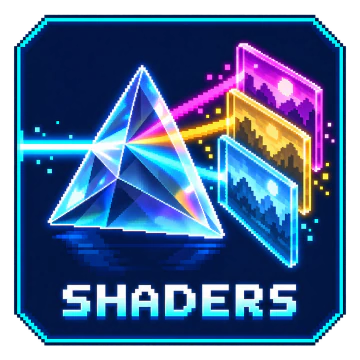
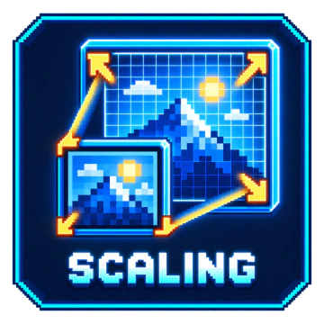
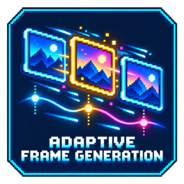

# MAKO - Frame Generation, Scaling, and Shaders on SteamOS/Linux

<p align="center">
  
</p>

<p align="center">
  <a href="https://trendshift.io/repositories/171701?utm_source=trendshift-badge&amp;utm_medium=badge&amp;utm_campaign=badge-trendshift-171701" target="_blank" rel="noopener noreferrer"></a>
</p>

<p align="center">
  <a href="https://discord.gg/NAVkyCq7Rc" target="_blank" rel="noopener noreferrer"></a>
  <a href="https://github.com/eugeniosegala/MAKO/actions/workflows/tests.yml" target="_blank" rel="noopener noreferrer"></a>
  <a href="LICENSE.md" target="_blank" rel="noopener noreferrer"></a>
  <br />
  <a href="https://github.com/eugeniosegala/MAKO/releases/latest" target="_blank" rel="noopener noreferrer"></a>
  <a href="https://github.com/eugeniosegala/MAKO/releases?q=render-v" target="_blank" rel="noopener noreferrer"></a>
  
</p>

<!-- prettier-ignore -->
> **Independent project:** MAKO is not an official Lossless Scaling, Decky Loader, lsfg-vk, vkBasalt, or ReShade release. MAKO does not contain or distribute Lossless Scaling, `Lossless.dll`, or extracted proprietary model payloads. LSFG frame generation and LS1 scaling read selected resources at runtime from a lawful, user-supplied <a href="https://store.steampowered.com/app/993090/Lossless_Scaling/" target="_blank" rel="noopener noreferrer">Lossless Scaling</a> installation; the open MAKO Scaler and bundled shaders do not require it. MAKO does not alter the user's DLL file, and translated resources remain process-local. Users are responsible for complying with the terms applicable to their copy. See <a href="THIRD_PARTY_NOTICES.md" target="_blank" rel="noopener noreferrer">Third-party notices</a>.

## Downloads

| Component | Recommended for | Releases |
| --- | --- | --- |
| **MAKO Decky** | Steam Deck, Steam Machine, and Decky Loader users (bundles MAKO Renderer) | <a href="https://github.com/eugeniosegala/MAKO/releases/latest" target="_blank" rel="noopener noreferrer">Latest MAKO Decky release (ZIP under Assets)</a> |
| **MAKO Renderer** | Direct Vulkan-layer installation without Decky | <a href="https://github.com/eugeniosegala/MAKO/releases/tag/render-v4.0.0" target="_blank" rel="noopener noreferrer">Latest MAKO Renderer release (Linux archive under Assets)</a> |

## Community

Join the official <a href="https://discord.gg/NAVkyCq7Rc" target="_blank" rel="noopener noreferrer">MAKO Discord</a> for discussion, testing, development, showcases, and live troubleshooting. GitHub remains the source of truth for <a href="https://github.com/eugeniosegala/MAKO/issues/new/choose" target="_blank" rel="noopener noreferrer">bug reports and feature requests</a>.

<!-- prettier-ignore -->
> [!TIP]
> **Want update alerts?** MAKO Decky and MAKO Renderer are published independently. At the top-right of the <a href="https://github.com/eugeniosegala/MAKO" target="_blank" rel="noopener noreferrer">MAKO GitHub repository</a> page, click **Watch** > **Custom**, select **Releases**, then click **Apply**. GitHub will notify you when a new release is published, subject to your GitHub notification settings.

Published Renderer packages currently target x86_64 Linux hosts and include layers for both 64-bit and 32-bit x86 game processes. Native AArch64/Armada packages are not included in this release.

## ✨ Feature Highlights

<p align="center">
  <br />
  <a href="plugin/docs/CONFIGURATION.md#shaders"></a>
  <a href="plugin/docs/CONFIGURATION.md#spatial-scaling"></a>
  <a href="plugin/docs/CONFIGURATION.md#hdr-through-the-isolated-gamescope-bridge"></a>
  <a href="plugin/docs/CONFIGURATION.md#frame-generation"></a>
  <br /><br />
</p>

- **Full-quality frame generation:** Lossless Scaling models from your licensed installation, with per-game quality and performance controls.
- **Reduced ghosting:** Full-quality v2 with Lighter FG Model off can reduce ghosting; supported AMD GPUs gain extra safeguards. Results vary by game.
- **Spatial scaling:** LS1 Quality, LS1 Performance, or the open MAKO Scaler, used alone or before frame generation.
- **Per-game shaders:** Live sharpening, anti-aliasing, colour, cinematic, and retro effects through bundled vkBasalt.
- **Adaptive Frame Generation:** Target 30–240 FPS with a selectable 2x–5x generation ceiling.
- **Display-aware pacing:** Adapts frame delivery to the presentation plan and Gamescope VRR state.
- **Experimental HDR (disabled by default):** HDR support for Scaling, Frame Generation, and Shaders through Gamescope. See [setup and requirements](engine/docs/CONFIGURATION.md#hdr-through-the-isolated-gamescope-bridge).
- **64-bit and 32-bit x86 support:** Matching Vulkan layers for native and Flatpak games.
- **Gamescope recovery:** Preserves real frames during presentation pressure and Steam-menu transitions.
- **Automatic profiles:** Saves per-game renderer and compatibility settings, matched by Steam app ID or process.
- **Launcher integration:** Per-game setup for Heroic, Lutris, and EmuDeck, including Steam shortcuts.
- **Native Steam Remote Play:** Opt-in frame generation, scaling, and shaders on the receiving device, controlled from MAKO Decky or the Qt UI.

## What MAKO is

MAKO (**Motion-Adaptive Kernel Orchestration**) brings LSFG frame generation, spatial scaling, and bundled shader effects to Linux gaming. **MAKO Scaler and shaders work without Lossless Scaling; only Frame Generation and LS1 require it.** Scaling can run alone or reconstruct real frames before Fixed or Adaptive Frame Generation.

The project consists of two closely integrated components:

- **MAKO Decky** is the Decky Loader component, providing per-game controls, installation, updates, Flatpak preparation, and game launch integration.
- **MAKO Renderer** is the Vulkan layer that provides the graphics pipeline for frame generation and spatial scaling; its packages also include optional bundled shader effects.

## In-game considerations

<!-- prettier-ignore -->
> [!TIP]
> **Try the game's V-Sync setting both on and off.** Neither setting is universally best: the result depends on the game, its FPS cap, VRR, and the compositor. Keep whichever option feels smoother and more responsive for that game.

Every game and display behaves differently, so compare one setting at a time. If Frame Generation, Scaling, or Shaders do not work, try the game's Fullscreen, Borderless Fullscreen, and Windowed modes; none is universally best. For Scaling, also try different in-game resolutions and check that **Live Status** shows **Input** smaller than **Display**. Changing display mode can change the resolution MAKO processes and its GPU cost. See the <a href="plugin/docs/CONFIGURATION.md" target="_blank" rel="noopener noreferrer">configuration guide</a> for which controls apply live and which require a restart.

## Install and use

1. **Install Decky Loader** if needed. Switch to Desktop Mode and follow the <a href="https://github.com/SteamDeckHomebrew/decky-loader#-installation" target="_blank" rel="noopener noreferrer">official Decky Loader installation guide</a>, then return to Game Mode.
2. **Install the default public version of <a href="https://store.steampowered.com/app/993090/Lossless_Scaling/" target="_blank" rel="noopener noreferrer">Lossless Scaling</a> from Steam if you will use frame generation or LS1 scaling.** MAKO can use beta branches, but they are not validated; the default public branch is recommended. MAKO reads its licensed `Lossless.dll`; MAKO Scaler and Shaders work without it.
3. Open the <a href="https://github.com/eugeniosegala/MAKO/releases/latest" target="_blank" rel="noopener noreferrer">latest MAKO Decky release</a> and download its ZIP under **Assets**.
4. In Decky's settings, enable **Developer Mode**, then select **Developer > Install Plugin from Zip**.
5. Open **MAKO Decky** and select **Install MAKO Renderer**. Installing the ZIP alone does not install its bundled Renderer.
6. For a native Steam or Proton game, add this under **Steam Properties > Launch Options**:

    ```text
    /home/deck/.local/bin/mako-run %command%
    ```

7. Start the game normally.
8. Experiment with the settings to find what works best for each game. Try Fixed or Adaptive Frame Generation, scaling, and shader effects independently.

<!-- prettier-ignore -->
> [!IMPORTANT]
> If Decky does not show or reload **MAKO Decky** after installing a ZIP, uninstall it, install the ZIP again, and restart your Steam Deck or Steam Machine. Then open the plugin and repeat step 5.

### Optional graphics integrations

MAKO Decky provides a per-profile **Gamescope WSI** option, host-installed MangoHud integration, and its own private 64-bit/32-bit vkBasalt build. Enable Shaders for a game to use MAKO-managed sharpening, anti-aliasing, and its bundled effect catalog without installing vkBasalt separately; MAKO does not use a system-wide vkBasalt copy. Scaling and Gamescope WSI are independent choices. See <a href="engine/docs/LAYER-CHAINING.md" target="_blank" rel="noopener noreferrer">optional graphics integrations</a> for ordering and limits.

### How to configure MAKO with third-party launchers

<a id="heroic"></a> <a id="heroic-and-other-flatpak-applications"></a> <a id="emudeck"></a> <a id="manually-added-flatpak-shortcuts"></a>

- [Heroic](plugin/docs/LAUNCHERS.md#heroic)
- [Lutris](plugin/docs/LAUNCHERS.md#lutris)
- [EmuDeck](plugin/docs/LAUNCHERS.md#emudeck)
- [Other Flatpak apps](plugin/docs/LAUNCHERS.md#manually-added-flatpak-shortcuts)
- [Other non-Steam games](plugin/docs/LAUNCHERS.md#other-non-steam-games)

For a step-by-step guide that creates a shareable report on the Desktop, see <a href="plugin/docs/COLLECT_DIAGNOSTICS.md" target="_blank" rel="noopener noreferrer">Collect MAKO Decky Diagnostics</a>.

### Updating MAKO Decky

<!-- prettier-ignore -->
> [!IMPORTANT]
> To prevent Decky retaining a previous plugin backend or bundled payload, especially when moving between local test ZIPs, uninstall MAKO Decky, install the newer ZIP, restart, then select **Install MAKO Renderer**.

1. Quit the games using MAKO.
2. Uninstall MAKO Decky, then install the newer ZIP through **Developer > Install Plugin from Zip**.
3. Restart your Steam Deck or Steam Machine.
4. Open MAKO Decky and select **Install MAKO Renderer** to install the version bundled in the ZIP.
5. If you use prepared Flatpak applications, open **Flatpak Setup** and select **Update** for each matching runtime extension shown by MAKO.

Valid profiles and Steam launch options are retained. If the saved Renderer configuration cannot be read or validated, installation recreates it with defaults. Uninstalling MAKO Decky removes the shared native Renderer, while Flatpak extensions remain installed separately; step 5 updates them.

## Use MAKO Renderer directly

Decky is optional. Desktop Linux users can install MAKO Renderer directly:

1. To use frame generation or LS1 scaling, purchase and install the **default public version** of <a href="https://store.steampowered.com/app/993090/Lossless_Scaling/" target="_blank" rel="noopener noreferrer">Lossless Scaling</a> through Steam. MAKO can use beta branches, but they are not validated; the default public branch is recommended. MAKO Scaler and Shaders work without it.
2. Download and extract `MAKO-Renderer-v<version>-linux.tar.xz` from the <a href="https://github.com/eugeniosegala/MAKO/releases/tag/render-v4.0.0" target="_blank" rel="noopener noreferrer">latest MAKO Renderer release</a>, then run **Install MAKO Renderer**. The installer opens **MAKO Renderer Configuration** and shows the launch option.
3. Create or select a profile and choose Frame Generation, scaling, and/or shader effects. Add the executable manually under **Profile Matching > Matched Processes**, or start the game normally and use **Detect Running Game…**, then close it. Detection only identifies the executable; it does not activate MAKO in the running game.
4. Every standalone native Steam or Proton game must start through MAKO. Add the option shown by the configuration window under **Steam Properties > General > Launch Options**, then use Steam's **Play** button normally:

    ```text
    ~/.local/bin/mako-launch %command%
    ```

    Set this once per game; Steam applies it on every launch. Use the complete option shown by the window when shaders are enabled. The window can be closed during play. For direct desktop commands, see [Renderer usage](engine/README.md#usage); for shader details, see [Optional graphics integrations](engine/docs/LAYER-CHAINING.md#standalone-mako-renderer-with-vkbasalt).

5. For Flatpak games, launchers, or emulators, follow the [standalone Flatpak guide](engine/docs/FLATPAK-GUIDE.md) to install the matching extension and prepare each app, then launch it normally. The Renderer configuration window does not prepare Flatpaks, and the host `mako-launch` command cannot replace sandbox setup.

Run the installer again to update. See the <a href="engine/README.md#direct-linux-installation" target="_blank" rel="noopener noreferrer">MAKO Renderer guide</a> for manual installation and removal.

<!-- prettier-ignore -->
> [!IMPORTANT]
> MAKO Decky and the standalone archive share one native Renderer. Installing either selects its version: the standalone installer warns before replacing Decky's version, while Decky adopts a valid standalone installation or offers its bundled update when versions differ. **Uninstall MAKO Renderer** removes the shared native files but keeps MAKO Decky and profiles; uninstalling MAKO Decky removes both the plugin and managed Renderer. Shared Flatpak extensions remain installed.

## Documentation

- <a href="plugin/docs/CONFIGURATION.md" target="_blank" rel="noopener noreferrer">MAKO Decky configuration</a>: panel controls, profiles, runtime boundaries, and compatibility.
- <a href="engine/docs/CONFIGURATION.md" target="_blank" rel="noopener noreferrer">MAKO Renderer configuration</a>: Qt controls, profiles, and game launch setup.
- <a href="engine/README.md" target="_blank" rel="noopener noreferrer">MAKO Renderer</a>: direct installation, usage, builds, and architecture guides.
- <a href="plugin/docs/TROUBLESHOOTING.md" target="_blank" rel="noopener noreferrer">Troubleshooting</a> and <a href="COLLECT_DIAGNOSTICS.md" target="_blank" rel="noopener noreferrer">diagnostics</a>: activation, presentation problems, and private reports.
- <a href="TESTING.md" target="_blank" rel="noopener noreferrer">Testing</a> and <a href="HOW_TO_RELEASE.md" target="_blank" rel="noopener noreferrer">releases</a>: contributor validation and publication.

## Featured in

Community creators have covered and tested the project on Steam Deck hardware. See <a href="plugin/docs/FEATURED_IN.md" target="_blank" rel="noopener noreferrer">Featured In</a> for video links, channels, and coverage details.

## Credits and project lineage

MAKO builds on and integrates work from these open-source projects and their communities:

- **<a href="https://github.com/xXJSONDeruloXx/decky-lsfg-vk" target="_blank" rel="noopener noreferrer">Kurt Himebauch / xXJSONDeruloXx</a>** created the original Decky LSFG-VK plugin that formed the foundation of MAKO's Decky interface, installation workflow, and per-game controls.
- **<a href="https://github.com/PancakeTAS/lsfg-vk" target="_blank" rel="noopener noreferrer">PancakeTAS</a>** and the **lsfg-vk contributors** created the GPL-3.0-or-later version 2 Vulkan layer and Linux integration from which MAKO Renderer descends. MAKO's direct upstream baseline is <a href="https://github.com/PancakeTAS/lsfg-vk/commit/8b0da2661c6f3473a7fccc8ba643880050e71642" target="_blank" rel="noopener noreferrer"><code>8b0da266</code></a>; the exact lineage and migration commits are recorded in <a href="LICENSE.md#lsfg-vk-renderer-lineage" target="_blank" rel="noopener noreferrer">LICENSE.md</a>.
- **<a href="https://github.com/DadSchoorse/vkBasalt" target="_blank" rel="noopener noreferrer">Georg Lehmann / DadSchoorse</a>** and the **vkBasalt contributors** created the Vulkan post-processing layer that MAKO bundles through its maintained fork. Selected shader effects come from <a href="https://github.com/CeeJayDK/SweetFX" target="_blank" rel="noopener noreferrer">CeeJayDK/SweetFX</a> and <a href="https://github.com/crosire/reshade-shaders" target="_blank" rel="noopener noreferrer">crosire/reshade-shaders</a>; exact source and license details are in <a href="THIRD_PARTY_NOTICES.md" target="_blank" rel="noopener noreferrer">Third-party notices</a>.

MAKO also thanks the **Lossless Scaling developers** for the LS1 and LSFG models accessed through each user's licensed installation, the **Wine/vkd3d developers** whose shader translator enables the Vulkan LS1 path, and the **Decky Loader team**, community contributors, testers, guide authors, and creators who helped make the project possible. The open MAKO Scaler is independently implemented in this repository.

The original copyright and license notices are preserved in <a href="LICENSE.md" target="_blank" rel="noopener noreferrer">LICENSE.md</a>. MAKO is an independent community project and is not affiliated with or endorsed by Lossless Scaling, Decky Loader, or the credited upstream projects.

## License

MAKO is distributed under <a href="LICENSE.md" target="_blank" rel="noopener noreferrer">GPL-3.0-or-later</a>. Required upstream notices and the user-supplied proprietary-component boundary are recorded in <a href="THIRD_PARTY_NOTICES.md" target="_blank" rel="noopener noreferrer">Third-party notices</a>, and visual sources are recorded in <a href="ASSET_PROVENANCE.md" target="_blank" rel="noopener noreferrer">Asset provenance</a>. Contributions are accepted under the policy in <a href="CONTRIBUTING.md" target="_blank" rel="noopener noreferrer">CONTRIBUTING.md</a>.

## AI-assisted development

MAKO uses coding agents as part of an evidence-driven engineering workflow while keeping architecture, review, validation, and release decisions under human ownership. See <a href="AI_USE.md" target="_blank" rel="noopener noreferrer">AI use in MAKO</a> for the full approach.

## Contributors

MAKO thanks everyone whose commits or co-authored work is in this repository. This gallery is generated from the current branch's Git history; upstream projects and other forms of help are credited above.

<!-- mako-contributors:start -->

<a href="https://github.com/eugeniosegala"></a> <a href="https://github.com/Hu2ki3"></a> <a href="https://github.com/hugouchoasborges"></a> <a href="https://github.com/lordkaus"></a> <a href="https://github.com/PJ-568"></a> <a href="https://github.com/Tak-attack"></a> <a href="https://github.com/w169q169"></a> <a href="https://github.com/WowOne987"></a>
<!-- mako-contributors:end -->

See <a href="CONTRIBUTING.md">Contributing</a> to get involved.
